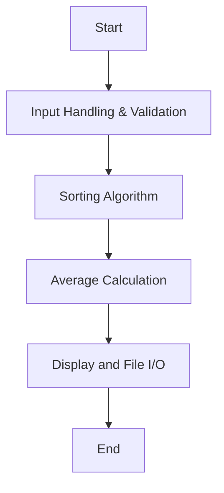

# Team Programming Assignment: Test Scores Analyzer

## Team Members
Team member 1, Team member 2

## Test Scores Analyzer Description
Your team has been hired to create a program that uses memory-safe programming methods to sort and calculate the average of an unknown number of test scores. The program will use dynamic memory allocation and pointers to efficiently process student test scores.

### Test Scores Analyzer Flowchart

#### Function Diagrams

| `inputValidation`    |               |  Member 1  |
| ------------------ | ------------- | ---------- |
| `scores: pointer`   | takes input from the user for test scores |              |
| `size: integer`     | validates input and ensures no negative numbers | updates memory allocation |
| `return: void`      | modifies scores dynamically | returns validated input |
***
| `sortScores`        |               |  Member 2  |
| ------------------ | ------------- | ---------- |
| `scores: pointer`   | sorts scores in ascending order | updates scores dynamically |
| `size: integer`     | number of test scores |  |
| `return: void`      | modifies scores dynamically | sorted order |
***
| `calculateAverage`  |               |  Member 1  |
| ------------------ | ------------- | ---------- |
| `scores: pointer`   | calculates average excluding lowest score | uses only pointer notation |
| `size: integer`     | number of test scores |  |
| `return: double`    | returns computed average | |
***
| `displayAndSave`    |               |  Member 2  |
| ------------------ | ------------- | ---------- |
| `scores: pointer`   | formats and displays results on screen |  |
| `size: integer`     | number of test scores |  |
| `file: text file`   | writes results to a file | clear formatting |
| `return: void`      | outputs formatted data | writes to results.txt |

## Core Functionalities
- **Dynamic Memory Allocation:**
  - Use `new` and `delete` to allocate and free memory for test scores dynamically.
  - Use pointer notation wherever possible.
- **Input Validation:**
  - Ensure no negative numbers are entered.
  - Prompt the user until valid input is received.
- **Sorting Function:**
  - Implement a function that uses pointers to sort the scores in ascending order.
- **Average Calculation:**
  - Write a function that calculates the average score, excluding the lowest score.
- **File I/O:**
  - Save the sorted scores and calculated average into `results.txt` with clear labels and formatting.

## Team Breakdown and Responsibilities
- **Member 1: Input Handling, Validation, and Average Calculation**
  - Develop logic for dynamically allocating memory and prompting user input.
  - Ensure inputs are validated and only positive integers are accepted.
  - Create the function to calculate the average score, dropping the lowest score.
  - Ensure the calculation uses only pointer notation.
- **Member 2: Sorting Algorithm, Display, and File I/O**
  - Implement a sorting function using pointers.
  - Work with Member 1 to ensure data is passed correctly between functions.
  - Format and display results on the screen.
  - Write sorted scores and average to a file with clear formatting and headings.

## Milestones and Timeline Goals
- **Day 1:**
  - Form teams and review assignment requirements.
  - Brainstorm program structure and break it into functions.
  - Assign roles and begin work on individual functions.
- **Day 2:**
  - Write and test basic functionality (e.g., input validation and dynamic memory allocation).
  - Start implementing the sorting function.
- **Day 3:**
  - Test the sorting function.
  - Begin work on average calculation and integrate with existing code.
- **Day 4:**
  - Test and refine all functions.
  - Implement file I/O and ensure results are saved correctly.
- **Day 5:**
  - Debug and finalize the program.
  - Test the program as a team to ensure all features work as expected.
  - Submit the program and results.

